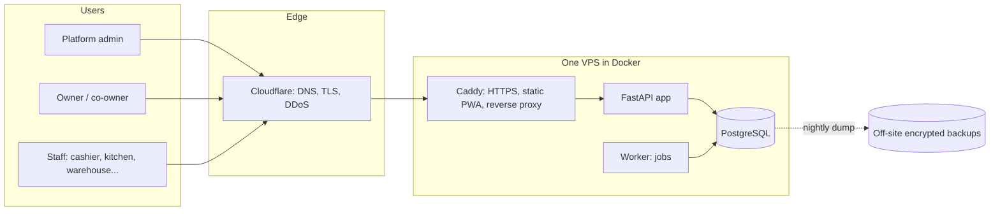
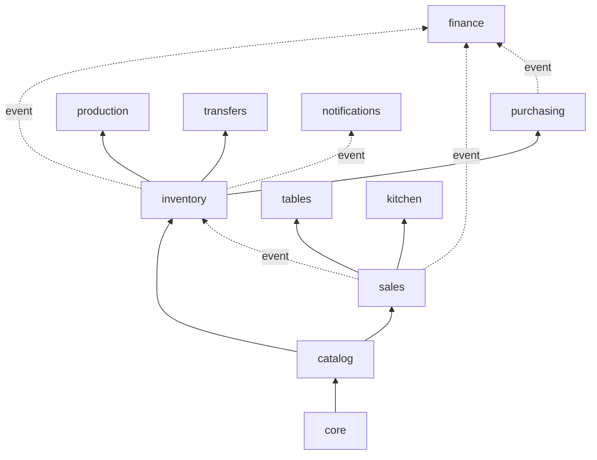
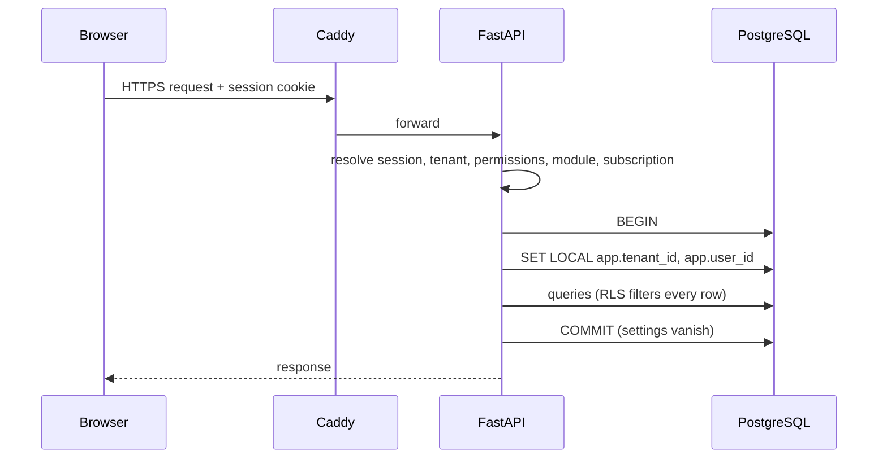

# 04. Architecture

## 1. Summary

A **modular monolith**: one backend application with strict internal module boundaries, one PostgreSQL database shared by all tenants (isolated by row-level security), one installable web app (PWA). It runs on a single small VPS and can be split later without rewriting.

Why not microservices: one developer, one small server, and a domain where correctness of stock and money across modules matters more than independent scaling. A monolith gives atomic transactions across modules and simple operations. The module rules below keep the option to split open (ADR-001).

## 2. Context



## 3. Technology choices

| Layer | Choice | Reason |
| --- | --- | --- |
| Language | Python 3.12+ | Existing skill; strong typing available |
| API | FastAPI, Pydantic v2 | Typed contracts, OpenAPI generated automatically |
| Database access | SQLAlchemy 2.x (async) with asyncpg | Mature, explicit transactions |
| Migrations | Alembic | Versioned schema changes |
| Database | PostgreSQL (current stable) | Row-level security, transactional DDL, JSONB, strong constraints |
| Background jobs | Postgres-backed queue (candidate: Procrastinate) | No Redis needed at launch; fewer moving parts |
| Cache | None at launch; Redis added only if measurements demand it | Saves memory on a small VPS |
| Auth | Server-side sessions in httpOnly cookies, CSRF protection, Argon2id, TOTP | Easy revocation, no tokens in browser storage |
| Frontend | React + TypeScript + Vite | Existing skill; fast build |
| UI kit | Tailwind CSS + Radix-based components (shadcn/ui style) | Accessible components, own the code |
| Data fetching | TanStack Query; typed client generated from OpenAPI | No hand-written API types |
| Forms | React Hook Form + Zod | Validation shared with types |
| i18n | i18next, ICU message format | EN/ID plus future languages |
| PWA | vite-plugin-pwa (Workbox) | Install on any device; offline later |
| Reverse proxy | Caddy | Automatic HTTPS, small footprint |
| Packaging | Docker and docker compose | Same stack on laptop and server |
| CI/CD | GitHub Actions, GitHub Container Registry | Free for private repos within limits **(verify)** |
| Code quality | ruff, mypy, import-linter, pytest, ESLint, tsc, Vitest, Playwright | See 08 |

Each choice is recorded as an ADR in [09](09-decisions-open-questions.md).

## 4. Backend structure

```
backend/
  app/
    core/            # identity, tenancy, settings, audit, events, jobs, i18n, subscription
    modules/
      catalog/       # items, units, bom, prices
      inventory/     # ledger, batches, counts, alerts
      purchasing/
      production/
      transfers/
      sales/
      tables/
      kitchen/
      finance/
      reports/
      notifications/
    admin/           # platform admin API (separate auth)
    main.py
  migrations/
  tests/
```

Each module contains the same layers:

| File | Role |
| --- | --- |
| `models.py` | SQLAlchemy tables owned by the module |
| `schemas.py` | Pydantic request and response models |
| `service.py` | Business logic; the only place that changes the module's tables |
| `router.py` | HTTP endpoints; thin, calls the service |
| `events.py` | Events the module publishes and handlers it registers |
| `permissions.py` | Permission codes and default role mapping |
| `module.py` | Manifest: name, dependencies, routers, permissions, nav entries, settings schema |

### Module rules (enforced by import-linter in CI)

1. A module may import only from `core` and from modules it declares as dependencies in `module.py`.
2. A module never reads or writes another module's tables directly; it calls that module's `service` interface or listens to its events.
3. Dependencies point downward: `core` is below `catalog`, which is below `inventory`, which is below `purchasing`, `production`, `transfers`, and so on. `finance`, `reports` and `notifications` depend on nothing optional; they listen to events and read through published read interfaces.
4. Optional integrations use events. Example: `sales` publishes `SaleRecorded`; `inventory` handles it to consume stock. If `inventory` is off, nothing consumes and nothing breaks.



Solid arrows are code dependencies. Dotted arrows are events.

## 5. Events and consistency

Two kinds of events:

| Kind | Delivery | Used for |
| --- | --- | --- |
| In-transaction | Handlers run synchronously inside the same database transaction as the publisher | Stock consumption, journal posting, balance updates: if a handler fails, the whole business action rolls back, so stock and money can never disagree |
| Outbox | Written to an `outbox` table in the same transaction, delivered by the worker after commit, at least once | Notifications, emails, report refresh, webhooks: must be idempotent |

This keeps the rule "stock and ledger postings are atomic with the document" (NFR-008) while keeping slow or failure-prone work out of the request.

## 6. Module switching

- `tenant_modules(tenant_id, module, enabled, enabled_at)` is the source of truth.
- A FastAPI dependency `require_module("inventory")` guards every router of that module. Disabled module: HTTP 403 with a clear code.
- The module manifest declares dependencies; enabling checks them, disabling warns about dependents.
- Event handlers of a disabled module are skipped for that tenant.
- The frontend asks `/me/capabilities` and builds navigation from it; this is a convenience, not security.
- Disabling never deletes data.

## 7. Multi-tenancy

Model: **shared database, shared schema, `tenant_id` on every tenant-owned row, row-level security as the safety net** (ADR-002).

Request flow:



Rules:

1. The application connects as a restricted role that is not a superuser and not the table owner. Migrations use a different role.
2. Every tenant table has `ENABLE` and `FORCE ROW LEVEL SECURITY` and a policy comparing `tenant_id` with `current_setting('app.tenant_id')`.
3. The tenant is set inside each transaction, never at session level, because pooled connections are reused between requests. Implementation note: `SET LOCAL` does not accept bind parameters, so the code calls `set_config('app.tenant_id', :id, true)` (the `true` makes it transaction-local), inside a helper that every database session must use.
4. If the setting is missing the policy returns no rows (fail closed).
5. Platform-admin requests set `app.is_platform_admin` through a separate code path, only in the admin application, and every use is audited.
6. Foreign keys on critical tables include `tenant_id` so a row can never reference another tenant's row.
7. Every tenant table has an index starting with `tenant_id`.
8. Automated tests try to read and write across tenants on every endpoint.

Why not schema-per-tenant or database-per-tenant: they isolate more strongly but multiply migrations and memory, which is costly on one small server. The decision is revisited if a large or regulated tenant requires it (the design keeps `tenant_id` everywhere, so extraction of one tenant into its own database stays possible).

## 8. Frontend structure

```
frontend/
  src/
    app/             # shell, routing, providers, capability-driven navigation
    features/        # one folder per module (catalog, inventory, sales, ...)
    components/      # shared UI primitives
    lib/             # api client (generated), auth, i18n, formatting
    locales/         # en.json, id.json
```

- Three layouts from one codebase: desktop (dense tables, side navigation), tablet (POS and counting, large touch targets), phone (bottom navigation, dashboards, approvals, receiving, counts).
- Server state in TanStack Query; local UI state kept minimal.
- The typed API client is generated from the backend OpenAPI schema in CI; a mismatch fails the build.
- The built PWA is served as static files by Caddy; there is no Node process in production.

## 9. API conventions

- REST over JSON, versioned under `/api/v1`.
- Tenant comes from the session, never from the URL or body.
- IDs are UUIDv7 (time-ordered) generated by the server; clients that create documents may supply an idempotency key.
- Errors use one shape: `code`, `message` (translatable key), `details`, `request_id`.
- Pagination is cursor-based for large lists.
- Money fields are integers in minor units with an explicit currency code; quantities are decimal strings.
- Long operations return a job ID and are polled or pushed via notification.

## 10. Background jobs

Run by a separate worker container using the same codebase:

| Job | Trigger |
| --- | --- |
| Outbox delivery | Continuous |
| Stock alert evaluation, DOI refresh | Every few minutes and after relevant postings |
| Daily consumption variance calculation | Nightly per tenant |
| Report refresh and exports | On demand |
| Subscription state transitions and reminders | Daily |
| Backup verification and cleanup | Daily |

## 11. Offline readiness (delivered in Phase 4)

Version 1 is online-only. To avoid a rewrite later:

- Every write accepts a client-generated idempotency key.
- Document IDs may be generated by the client (UUID).
- The POS keeps catalog and prices in a cached store that can be refreshed.
- Conflicts are resolved by rules per document type (orders append-only; stock movements are never merged, only appended).

## 12. Scaling path

| Stage | Trigger (to be set from load tests) | Action |
| --- | --- | --- |
| 1 | Launch | Single VPS, everything in Docker |
| 2 | CPU or memory pressure | Vertical resize of the VPS |
| 3 | Database dominates | Move PostgreSQL to its own server; add connection pooler (PgBouncer in transaction mode, which is compatible with `SET LOCAL`) |
| 4 | Read-heavy reports | Read replica for reports |
| 5 | Request volume | Several API containers behind a load balancer; Redis for cache and rate limits |
| 6 | Large or regulated tenant | Move that tenant to a dedicated database |

## 13. Failure modes and responses

| Failure | Effect | Response |
| --- | --- | --- |
| API container crashes | Brief outage | Docker restart policy; uptime alert |
| Database unavailable | Full outage | Alert; restore procedure in 07 |
| Worker down | Alerts and reports delayed, POS unaffected | Health check and alert |
| Bad deploy | Errors after release | One-command rollback to previous image; migrations written to be backward compatible for one release |
| Disk full | Database stops | Disk alert at 80%; log rotation; backup retention limits |
