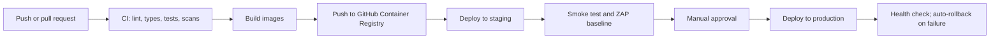

# 07. Infrastructure and Cost

Principle: the cheapest setup that is still secure and recoverable, with a clear next step when it stops being enough. Prices were read on 2026-10-07 and must be re-checked **(verify)**.

## 1. Environments

| Environment | Where | Purpose |
| --- | --- | --- |
| Local | Developer laptop, `docker compose up` | Daily development |
| CI | GitHub Actions | Tests, scans, image builds |
| Staging | Same VPS, separate compose project, separate database, capped memory; or a second small VPS if resources are tight | Rehearse releases and migrations, ZAP scans |
| Production | The VPS | Real tenants |

Production and staging never share a database or secrets.

## 2. Launch topology

One VPS running Docker Compose:

| Service | Purpose | Notes |
| --- | --- | --- |
| `caddy` | HTTPS, serves the built PWA files, reverse proxy to the API, security headers, rate limits | Automatic certificates |
| `api` | FastAPI application, 2 worker processes | Non-root |
| `worker` | Background jobs, same image as `api` | Non-root |
| `db` | PostgreSQL with a named volume | Not exposed outside the Docker network |
| `backup` | Scheduled encrypted dump and upload, plus WAL archiving from Phase 2 | |

Redis is not part of the launch topology (ADR-005). Cloudflare (free plan) sits in front for DNS, TLS to the edge, DDoS protection and hiding the origin IP; the origin accepts web traffic only from Cloudflare ranges. TLS between Cloudflare and the origin uses "Full (strict)" mode with a valid origin certificate (Caddy-issued or a Cloudflare origin certificate); the exact setup is settled in Phase 0.

## 3. Sizing and memory budget (estimates to be measured)

| Component | Approximate memory |
| --- | --- |
| Operating system and Docker | 300 to 400 MB |
| PostgreSQL (shared buffers about 512 MB, plus connections) | 800 MB to 1.2 GB |
| API (2 workers) | 300 to 500 MB |
| Worker | 150 to 250 MB |
| Caddy | 30 to 60 MB |
| Backup process during dump | 100 to 200 MB |
| **Total** | **about 2 to 2.7 GB** |

A 4 GB plan leaves headroom; a 2 GB plan would be tight (hence the recommendation in the project plan). The first load test (Phase 1 exit) replaces these estimates with measurements and sets the tenant and outlet capacity of one server.

## 4. Hosting options

| Option | Spec | Price | Payment | Notes |
| --- | --- | --- | --- | --- |
| [Biznet Gio NEO Lite MS 4.2](https://biznetgio.com/pricelist) (recommended) | 2 cores, 4 GB RAM, 60 GB SSD | Rp125.000 per month before 11% tax, so about Rp138.750 | Prepaid balance topped up in their portal. Their [legal page](https://www.biznetgio.com/legal) lists card, bank transfer, e-wallet and QRIS; an older [help page](https://kb.biznetgio.com/id_ID/billing/metode-pembayaran-neo-cloud) lists fewer. **Confirm on the top-up screen.** | Indonesian data center, KVM, Docker supported |
| Biznet Gio NEO Lite MS 4.4 | 4 cores, 4 GB RAM | Rp165.000 before tax | Same | If CPU becomes the limit |
| [Hostinger KVM 2](https://desking.app/blog/hostinger-vps-plans-pricing-and-which-plan-to-choose) (fallback) | 2 vCPU, 8 GB RAM, 100 GB NVMe | About 8.79 USD intro, 14.99 USD renewal | [Virtual account, OVO, QRIS](https://www.hostinger.com/id/support/?p=693) | Data center location to confirm |
| IDCloudHost Cloud VPS | various | from about Rp40.000 per a comparison-site listing **(verify)** | Bank transfer listed | Not yet evaluated in depth |

Decision pending Q-004 and Q-005.

## 5. Monthly cost estimate (launch)

| Item | Estimate | Basis |
| --- | --- | --- |
| VPS (NEO Lite MS 4.2) | Rp138.750 | Price list plus 11% tax |
| Domain | to be quoted | `.com` simplest; `.id` usually needs Indonesian ID documents **(verify)** |
| Cloudflare | Rp0 | Free plan |
| Backup storage | to be quoted | Needs a provider payable without a card (Q-004) |
| Email sending | Rp0 at launch | Free tier of a transactional provider, or a mailbox from the domain registrar **(verify)** |
| Error tracking and uptime | Rp0 | Free tiers |
| **Total** | **about Rp140.000 plus domain and backup** | Target under Rp250.000 |

## 6. Network and hardening

- Firewall: allow 80 and 443 (from Cloudflare only) and SSH from known addresses; everything else denied.
- SSH keys only; root login disabled; fail2ban or equivalent.
- Automatic security updates for the OS; images rebuilt weekly for base-image patches.
- Time sync enabled (important for TOTP and audit).
- Docker: non-root users, read-only root file systems where possible, resource limits per container, restart policy `unless-stopped`.
- Secrets in a root-owned file with mode 600 mounted into containers.

## 7. Deployment pipeline

- Releases are tagged; images are immutable and tagged by version.
- The deploy script pulls the new image, runs migrations, restarts services and checks `/health`.
- Rollback: redeploy the previous tag. Migrations are written so the previous version still runs against the new schema for one release (expand, then contract).
- Deploy windows avoid tenant peak hours; maintenance banner supported.

## 8. Backups and disaster recovery

| Aspect | Launch | From Phase 2 |
| --- | --- | --- |
| Method | Nightly logical dump, encrypted, uploaded off-server | Add continuous WAL archiving |
| Recovery point objective | Up to 24 h | 5 to 15 min |
| Retention | 7 daily, 4 weekly, 6 monthly | Same plus WAL window |
| Location | Different provider or account than the VPS | Same |
| Restore test | Monthly into a scratch database, then run ledger invariants | Same |
| Recovery time objective | 4 h | 2 h |

Disaster procedure (kept as a runbook in the repo): provision a new VPS, restore the latest backup, point DNS, verify with smoke tests, announce.

Per-tenant restore is a logical export and import filtered by `tenant_id`, used for tenant data requests and partial recovery.

## 9. Monitoring and alerting

| Signal | Tool (candidate) | Alert |
| --- | --- | --- |
| Uptime of `/health` | Free external uptime monitor | Down for 2 minutes |
| Errors | Error tracker with PII scrubbing | New or spiking errors |
| Disk, memory, CPU | Host metrics (node exporter or provider graphs) | Disk above 80%, memory above 85% |
| Job queue | App metrics | Backlog or repeated failures |
| Backups | Job result | Missed or failed backup |
| Security events | Audit log thresholds | Lockout spikes, permission denial spikes |
| Certificates and domain | Uptime monitor | Expiry within 14 days |

## 10. Capacity and load testing

- Phase 1 exit: load test with k6 using generated data (for example 10 tenants, 60 outlets, 50 concurrent POS users, a month of history) against the launch VPS.
- Record p95 latency, database size growth and memory use; publish the numbers in `docs/capacity.md`.
- Re-test after each phase and before onboarding the 5th and 15th tenant.

## 11. Data growth estimate (to be validated)

`stock_movements`, `sales_lines` and `audit_log` dominate growth. Assume each order produces one sales document, a few lines and several stock movements through recipes. Measure real row sizes during the load test and set partitioning and archival thresholds then.

## 12. Cost control levers

- Keep Redis, search engines and extra services out until measurements demand them.
- Static PWA files served by Caddy (no Node runtime).
- Reports computed by nightly jobs and cached, not on every view.
- Compress and re-encode uploaded images; cap upload size.
- Prune expired sessions and old notifications on a schedule.
- Prefer vertical resize over adding servers until the database becomes the bottleneck.
