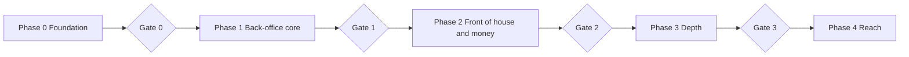

# 08. Roadmap and Engineering

One developer, so the plan is sliced into small releases that are each usable, tested and deployable. No calendar dates yet; they depend on hours per week (Q-011). Sizes are relative: S (days), M (about two weeks), L (about a month or more).

## 1. Phases and gates



| Gate | Criteria to pass |
| --- | --- |
| 0 | CI green; deploy to staging by pipeline; two test tenants cannot see each other's data (automated); admin can create a tenant and set its subscription; backup and restore drill passed |
| 1 | First tenant's real ingredients, recipes and opening stock loaded; seven days of real use; stock ledger invariants hold; load test recorded; security review of phase scope done |
| 2 | One outlet runs a full week on POS and tables; cash shift variance report matches reality; independent penetration test passed before any external paying tenant |
| 3 | Books for one full month reconcile with the accountant; reservation conflicts handled; forecast sanity-checked against actuals |
| 4 | Offline scenario tests pass (network cut mid-order, resync without duplicates); gateway reconciliation matches settlements |

## 2. Phase 0: Foundation (size M to L)

Slices, in order:

1. Repository, tooling, CI, Docker Compose (local), pre-commit, docs folder, ADR template, data inventory document (`docs/data-inventory.md`, see 06).
2. Backend skeleton: settings, logging, request IDs, error format, health check, idempotency keys (FR-X-003), list pagination and filtering (FR-X-004), module registry and manifest, import-linter contracts.
3. Database baseline: migration setup, roles (owner, app, readonly), RLS helper and schema test, `tenants`, `outlets`, `users`, `memberships`, `roles` (FR-TEN-001, 002).
4. Authentication: sign-in, sessions, CSRF, TOTP, invitations, password reset, rate limits, audit log (FR-IDN-001 to 003, 005 to 010; FR-AUD-001 to 003).
5. Authorization framework: permission codes, scope, module gate and module switches (FR-TEN-003), subscription gate, approval service skeleton.
6. Admin console API and UI: tenants, plans, modules, subscription dates, impersonation (FR-ADM-001 to 003, FR-SUB-001 to 005).
7. Frontend shell: routing, layouts for desktop, tablet and phone (FR-X-006), i18n in EN and ID (FR-X-001), locale formatting (FR-X-002), capability-driven navigation, generated API client, PWA install.
8. Deployment: Dockerfiles, production compose, Caddy, staging and production pipelines, backups, monitoring, runbooks.

Exit: Gate 0.

## 3. Phase 1: Back-office core (size L, split in slices)

| Slice | Content | Requirements |
| --- | --- | --- |
| 1a | Tenant settings: tax, service charge, payment methods, numbering, approval and alert rules | FR-TEN-004 to 009, 011 |
| 1b | Catalog: units, items, categories, conversions, translations, menu, modifiers, channel prices | FR-CAT-001 to 004, 008, 009 |
| 1c | BOM with versions, cycle check, theoretical cost and margin | FR-CAT-005 to 007 |
| 1d | Import and export (CSV/XLSX) for items, recipes, vendors, opening stock | FR-IMP-001 to 003 |
| 1e | Inventory ledger, batches, FEFO, moving average, balances, valuation, invariants; reversals instead of deletes | FR-INV-001 to 006, 014, FR-X-005 |
| 1f | Purchasing: vendors, vendor items, PR, PO, receiving, quick purchase, price and lead history, PDF | FR-PUR-001 to 006, 010 |
| 1g | Production orders with yield and costing | FR-PRD-001 to 004 |
| 1h | Transfers with approval, delivery note PDF, receiving discrepancies | FR-TRF-001 to 004 |
| 1i | Counts, waste, adjustments with approvals | FR-INV-007 to 009 |
| 1j | Stock levels, DOI, alerts, reorder suggestions, notification center | FR-INV-010 to 013, FR-NTF-001 to 003 |
| 1k | Manual daily sales entry with recipe consumption and day lock | FR-SAL-001 to 003, FR-CAT-010 |
| 1l | Reports and variance: daily flash, sales, HPP, stock, purchases, theoretical vs actual | FR-RPT-001 to 006, 010, 011, FR-INV-015 |
| 1m | Admin usage overview and feature flags, audit log filters and export, subscription state notifications | FR-ADM-004, 006, FR-AUD-004, FR-SUB-006 |
| 1n | Load test, security review, pilot with first tenant | Gate 1 |

Why this order: the ledger (1e) must exist before anything posts to it; recipes (1c) before sales (1k); reports (1l) last because they read everything.

## 4. Phase 2: Front of house and money (size L)

Cashier POS and orders, payments and shifts, tables and sessions, kitchen display and tickets, receipts and Bluetooth printing, PIN login and devices, discounts and voids, finance-lite and tax report, combos, lot traceability, vendor returns and bills, prep sheets, WAL archiving.

Requirements: FR-SAL-004 to 010, FR-RPT-012, FR-TBL-001 to 004, FR-KDS-001 to 004, FR-IDN-004, FR-FIN-001, 008, FR-CAT-011, FR-INV-016, FR-PUR-008, 009, FR-PRD-006.

## 5. Phase 3: Depth (size L)

Reservations and waitlist, double-entry accounting with automatic journals and period close, AP/AR, platform settlement, EOQ and forecasting, menu engineering and prime cost, wholesale invoices and customers, storage locations, barcode labels, best-vendor suggestion, standing transfers, tenant data export, push notifications, announcements, help.

Requirements: FR-TBL-005 to 009, FR-FIN-002 to 007, 009, FR-INV-017 to 019, FR-RPT-007, 008, FR-SAL-011, 012, FR-PUR-007, FR-PRD-005, FR-TRF-005, 006, FR-TEN-010, FR-NTF-005, FR-ADM-005, 007, FR-X-007.

## 6. Phase 4: Reach (size L, order by demand)

Offline mode, payment gateway, delivery-platform integration, loyalty, public booking, WhatsApp notifications, scheduled reports, budgets, platform sales file import.

Requirements: FR-SAL-013 to 016, FR-TBL-010, FR-NTF-004, FR-RPT-009, FR-FIN-010, FR-IMP-004.

## 7. Repository layout

```
restaurant-pos/
  backend/            # FastAPI app, migrations, tests
  frontend/           # React PWA
  infra/              # compose files, Caddyfile, deploy and backup scripts
  docs/               # these documents, ADRs, runbooks
  scripts/            # developer helpers, seed data
  .github/workflows/  # CI and deploy
```

## 8. Engineering practices

| Area | Practice |
| --- | --- |
| Branching | Trunk-based: short-lived branches, pull requests even when working alone, squash merge |
| Commits | Conventional Commits; changelog generated from them |
| Versioning | Release tags; images tagged by version |
| Style | ruff (lint and format), mypy (strict in `core`, `inventory`, `finance`), ESLint, Prettier, `tsc --noEmit` |
| Boundaries | import-linter contracts from 04; failing contract fails CI |
| Migrations | One Alembic history; expand-contract for risky changes; a test upgrades an empty database and a seeded previous-release snapshot |
| API contract | OpenAPI generated; frontend client generated; CI diff check |
| Docs | Every new decision gets an ADR; every requirement ID appears in a test name or commit when implemented |
| Reviews | Self-review checklist per pull request (security, tenancy, permissions, audit, tests, docs) |
| Seed data | Demo tenants (restaurant, cloud kitchen, central kitchen group) with realistic Indonesian menus for development and demos |

## 9. Testing strategy

| Level | Tools | Focus |
| --- | --- | --- |
| Unit | pytest, Vitest | Pure logic: costing, unit conversion, tax and rounding, permission evaluation |
| Property-based | Hypothesis | Ledger invariants I-1 to I-4 (05): random sequences of receipts, sales, transfers, productions keep balances and values consistent |
| Integration | pytest with a real PostgreSQL container | Services with RLS on, transactions, FEFO, approvals |
| Tenant isolation | Generated route tests | Every endpoint against another tenant's IDs returns not found |
| Permissions | Generated matrix tests | Table in 03 matches code; each role denied what it should be |
| Contract | OpenAPI schema checks | Backward-compatible changes only within a release |
| End to end | Playwright | Critical flows: sign-in, create recipe, receive goods, sell, count, approve, transfer |
| Migration | Scripted | Upgrade from previous release snapshot; downgrade for the last migration |
| Load | k6 | Targets in NFR-001 and NFR-002 |
| Security | ZAP baseline, scanners (06) | Every release |
| Accessibility | axe checks in Playwright | Key screens |

Coverage expectations: ledger, costing, tax and permission code at least 90% branch coverage; overall at least 80%. Coverage is a signal, not the goal; the invariants matter more.

## 10. Definition of done (per slice)

1. Requirements implemented and traceable by ID.
2. Unit, integration, tenant-isolation and permission tests pass.
3. Audit events and approvals wired where the requirement says so.
4. EN and ID strings present.
5. Works on desktop, tablet and phone layouts where relevant.
6. Migrations reviewed, reversible or expand-contract.
7. Security checklist for the slice done; scanners clean.
8. Docs and ADRs updated; changelog entry written.
9. Deployed to staging and smoke-tested.

## 11. Risk register

| Risk | Impact | Likelihood | Mitigation |
| --- | --- | --- | --- |
| Scope too large for one developer | Project stalls | High | Strict phases; every slice shippable; defer Phase 3 and 4 without regret |
| Ledger or costing bugs | Wrong money and stock | Medium | Property-based tests, invariants job, reversal-only corrections |
| Tenant data leak | Loss of trust, legal exposure | Low but severe | Four isolation layers, automated tests, penetration test |
| Wrong tax or service charge handling | Compliance issues for tenants | Medium | Configurable rules, tax advisor review, clear disclaimers |
| Single server failure | Outage and data loss | Medium | Backups, restore drills, runbook, fast rebuild |
| Delivery-platform terms or API access | Integration blocked | Medium | Manual entry first; partner integration later |
| Recipe data entry burden for tenants | Low adoption | High | CSV import, copy from template, start with top sellers |
| Performance on small VPS | Slow POS | Medium | Load tests, caching reports, vertical resize path |
| Key-person dependency | Bus factor of one | High | Docs, runbooks, simple tech, automated deploys |
| Payment method constraints for services | Cannot pay a vendor | Low | Choose providers accepting VA, e-wallet or QRIS; keep a fallback |

## 12. Change control

Requirements change through pull requests to these docs. A change that alters a decision updates its ADR (status superseded, new ADR added). The functional spec version bumps on any added, removed or re-phased requirement.
